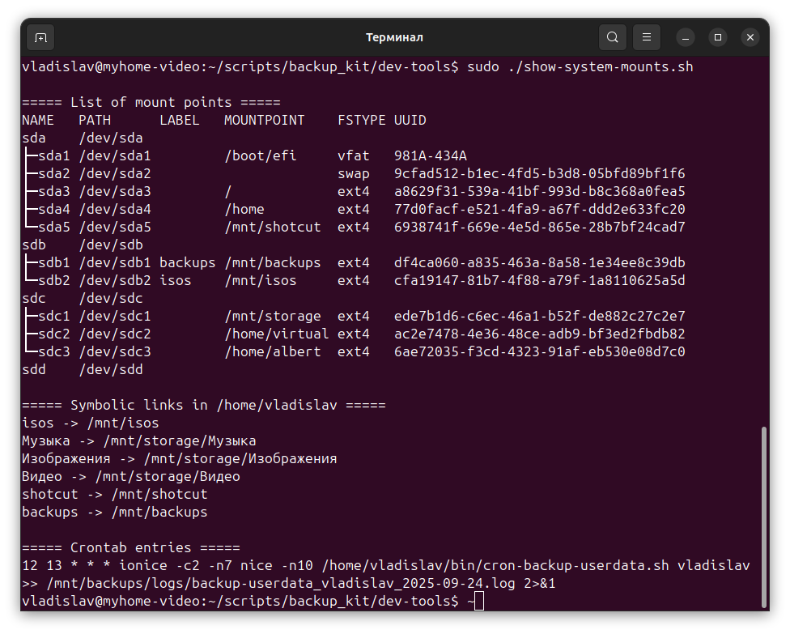

# Reincarnation Backup Kit — Ubuntu System Backup & Restore Scripts

[](LICENSE)


[🇬🇧 English](docs/EN/README_EN.md) | [🇷🇺 Русский](docs/RU/README_RU.md)

**Reincarnation Backup Kit** is a set of Bash scripts for backup and restore when reinstalling **Ubuntu** on an SSD, as well as for creating a multimedia environment (Shotcut, GIMP+G'MIC, Krita, Audacity).

---

## Why this project?

When reinstalling Linux, I often worried about losing my work, videos or photos.
With this Backup Kit I can make archives anytime, and when it's time to reinstall,
I do it without stress — everything is safe, and recovery is simple.

The main goal: **save your nerves during system reinstallations**.

## ✨ Features

### 🗄️ Backup and Restore
Consists of two independent parts:
1. **System Backup** — system configuration, package lists, repositories.
2. **User Backup** — home directories (/home/...), documents, and personal data.

> ⚠️ Important: Both parts complement each other. You can use only the system backup, only the user backup, or both at once.

### 🎬 Creating a Multimedia Environment
Consists of two steps:
1. **Format** the selected HDD and create users.
2. **NVIDIA GPU and CUDA testing**, software installation:
   - [Shotcut](https://shotcut.org/) (video editor)
   - [GIMP+G'MIC](https://gmic.eu/) (graphics)
   - [Krita](https://krita.org/en/) (drawing)
   - [Audacity](https://www.audacityteam.org/) (sound)
   - creating presets for Shotcut

> ⚠️ Important: You can only use the multimedia environment creation feature under Ubuntu, regardless of a backup.

## 📂 Brief instructions

### 1. System Backup Scripts
| Script | Description |
|--------|---------|
| `backup-system.sh` | Creates a backup of system files and settings. |
| `restore-system.sh` | Restores system files from a backup. |

### 2. User Data Scripts
| Script | Description |
|--------|---------|
| `backup-userdata.sh` | Daily/manual backup of user data. |
| `restore-userdata.sh` | Safely restores user data. |

### 3. Utilities and Wrappers
| Script | Description |
|--------|----------|
| `check-last-archive.sh` | Checks for the presence of the user's last archive. |
| `install.sh` | Installs Backup Kit and creates directories and permissions. |
| `hdd-setup-profiles.sh` | Format the selected hard drive (HDD) and create users. |
| `show-system-mounts.sh` | View system mount points, symbolic links, and cron jobs. |
| `menu.sh` | Text menu for Reincarnation Backup Kit |

### 4. Media and GPU Tools
| Script | Description |
|--------|---------|
| `install-nvidia-cuda.sh` | Installs NVIDIA and CUDA drivers. |
| `check-shotcut-gpu.sh` | Checks GPU availability for Shotcut. |
| `install-mediatools-flatpak.sh` | Install media tools via Flatpak. |
| `install-mediatools-apt.sh` | Install media tools via APT. |

### 5. Automatic backup via cron
| Script | Description |
|--------|---------|
| `add-cron-backup.sh` | Adds a cron job for daily backups. |
| `cron-backup-userdata.sh` | Archives user data to /mnt/backups/user_data// |
| `clean-backup-logs.sh` | Clears old logs. |
| `remove-cron-backup.sh` | Removes the backup cron job. |

## Reincarnation Backup Kit Text Menu

After installation, you can use a simple text menu:
```bash
~/bin/menu.sh
```

The menu allows you to:
- Run a system backup
- Run a user data backup
- Set up regular cron runs
- Clear old logs
- Manage the CUDA Toolkit (optional)

> ⚠️ The menu will launch automatically after successful installation..

> ⚠️ Some operations require root (sudo) privileges.
Other options are accessible without privileges.

## 🚀 Quick Start / Быстрый старт

```bash
git clone https://github.com/username/backup-kit.git
cd backup-kit
./install.sh
./backup-system.sh
./restore-system.sh
./backup-userdata.sh
./backup-userdata.sh --fresh
./restore-userdata.sh
```

## 📖 Documentation / Документация

- [📖 Documentation (EN)](docs/EN/README_ALL_EN.md)
- [📖 Документация (RU)](docs/RU/README_ALL_RU.md)

## ⚖️ License / Лицензия

MIT License © 2025 Vladislav Krashevsky

## Contact and support / Контакты и поддержка

Author: Vladislav Krashevsky
Support: ChatGPT and project documentation

## 🖼️ Screenshots

<p align="center"> 
 
 </p> 
<p align="center"> 

 </p>
<p align="center"> 

 </p> 

