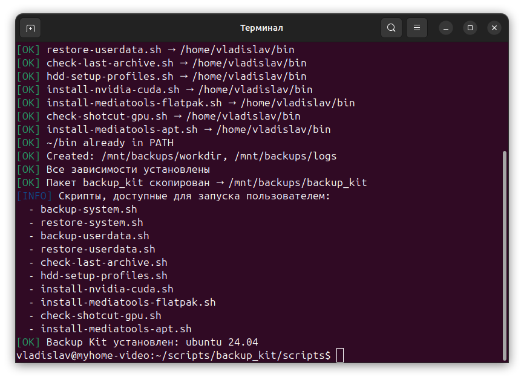
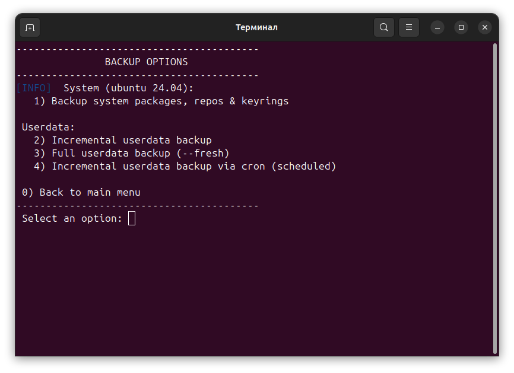
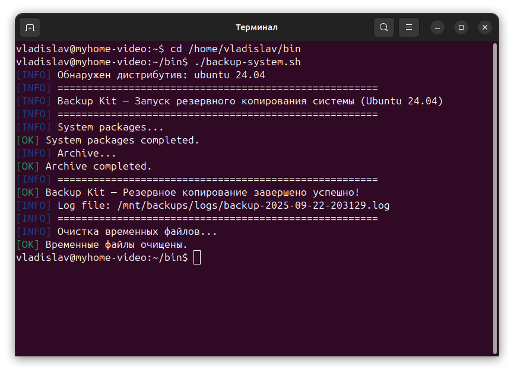
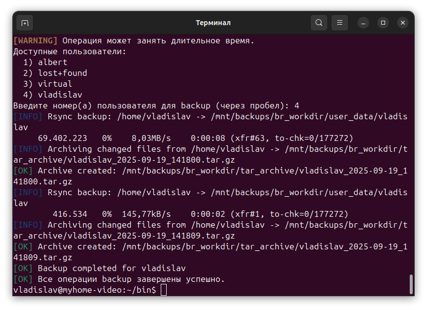
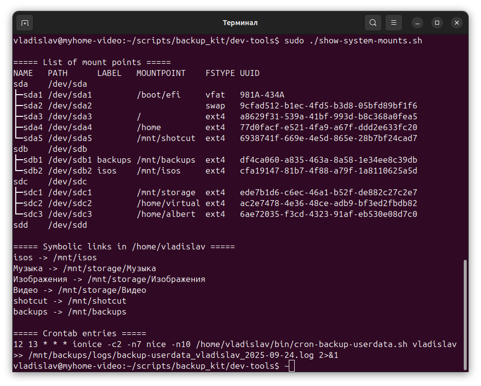
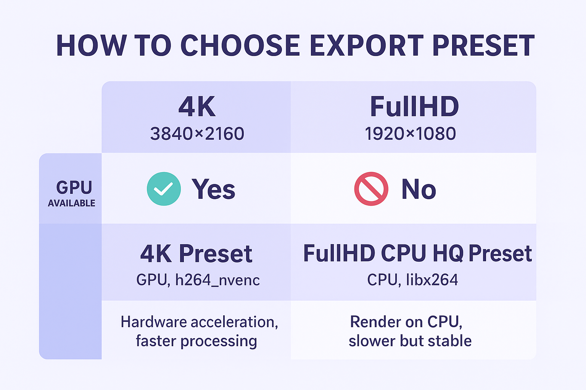

# Backup Kit — Ubuntu System Backup & Restore

[🇬🇧 English](README_EN.md) | [🇷🇺 Русский](../RU/README_RU.md)

**Reincarnation Backup Kit** is a set of Bash scripts for backup and restore when reinstalling **Ubuntu** on an SSD, as well as for creating a multimedia environment (Shotcut, GIMP+G'MIC, Krita, Audacity).

## ✨ Features

### 📦 Backup and Restore
Consists of two independent parts:
1. **System Backup** — system configuration, package lists, repositories.
2. **User Backup** — home directories (`/home/...`), documents, and personal data.

> ⚠️ Important: Both parts complement each other. You can use only the system backup, only the user backup, or both at once.

### 🎬 Multimedia Environment
Consists of two steps:
1. **Format** the selected HDD and create users.
2. **NVIDIA GPU and CUDA testing**, software installation:
   - [Shotcut](https://shotcut.org/) (video editor)
   - [GIMP+G'MIC](https://gmic.eu/) (graphics)
   - [Krita](https://krita.org/en/) (drawing)
   - [Audacity](https://www.audacityteam.org/) (sound)
   - creating presets for Shotcut

> ⚠️ Important: You can use the multimedia environment setup independently, without backup.

## Reincarnation Backup Kit Text Menu

After installation, you can use a simple text menu:
```bash
~/bin/menu.sh
```

> ⚠️ The menu will launch automatically after successful installation..
> ⚠️ Some operations require root (sudo) privileges.
Other options are accessible without privileges.

## 🚀 Quick Usage

```bash
git clone https://github.com/username/reincarnation-backup-kit.git
cd reincarnation-backup-kit
./install.sh

# Backup example
./backup-system.sh
udo ./backup-userdata.sh

# Example of a complete archive update (with deletion of the old mirror)
sudo ./backup-userdata.sh --fresh

# Restore example
./restore-system.sh
./bacsudo ./restore-userdata.sh
```

## 📜 Available Scripts

- `install.sh` — universal installer for the Reincarnation Backup Kit.
- `backup-system.sh` - backup system settings and packages (shell).
- `backup-ubuntu-22.04.sh` — archiving Ubuntu 22.04 packages and configurations.
- `backup-ubuntu-24.04.sh` — archiving Ubuntu 24.04 packages and configurations.
- `backup-debian-12.sh` — archiving Debian 12 packages and configurations.
- `restore-system.sh` — universal system restore (shell).
- `restore-ubuntu-22.04.sh` — restore for Ubuntu 22.04.
- `restore-ubuntu-24.04.sh` — restore for Ubuntu 24.04.
- `restore-debian-12.sh` — restore for Debian 12.
- `backup-restore-userdata.sh` — carefully backup or restore user data.
- `backup-userdata.sh` - backup user data (wrapper for backup-restore-userdata.sh).
- `restore-userdata.sh` — secure data recovery (wrapper for backup-restore-userdata.sh).
- `hdd-setup-profiles.sh` — format the selected hard drive (HDD) and create users.
- `install-mediatools-apt.sh` —  installs multimedia software from APT.
- `check-shotcut-gpu.sh` — automatic NVIDIA configuration, GPU passthrough to Flatpak, and NVENC testing.
- `install-nvidia-cuda.sh` - установка драйвера NVIDIA и CUDA.
- `install-mediatools-flatpak.sh` — NVIDIA + CUDA check, media installation from Flathub, Shotcut presets.
- `check-last-archive.sh` — views archives available to the user.
- `add-cron-backup.sh` - adds a cron job for daily backups.
- `clean-backup-logs.sh` - deletes old backup logs.
- `cron-backup-userdata.sh` - archives user data to /mnt/backups/user_data/.
- `clean-backup-logs.sh` - deletes old backup logs.
- `remove-cron-backup.sh` - removes the backup cron job.
- `show-system-mounts.sh` - view system mount points, symbolic links, and cron jobs.
- `check-cuda-tools.sh` - checking and managing CUDA Toolkit.
- `menu.sh` - Text menu for Reincarnation Backup Kit.

## ⚖️ License

MIT License © 2025 Vladislav Krashevsky

## 📬 Contact & Support

Author: Vladislav Krashevsky
Support: ChatGPT + project documentation

## 🖼️ Screenshots

<p align="center"> 
 
 </p>  </p> 
<p align="center"> 

 </p> 
<p align="center"> 

 </p> 


