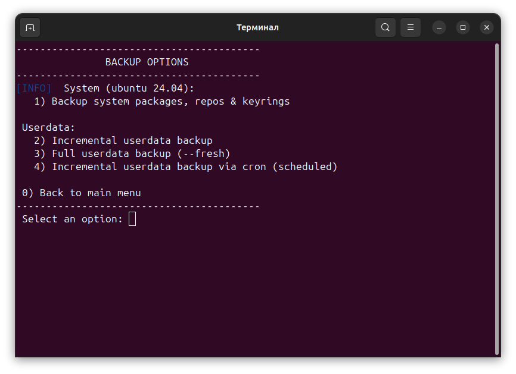
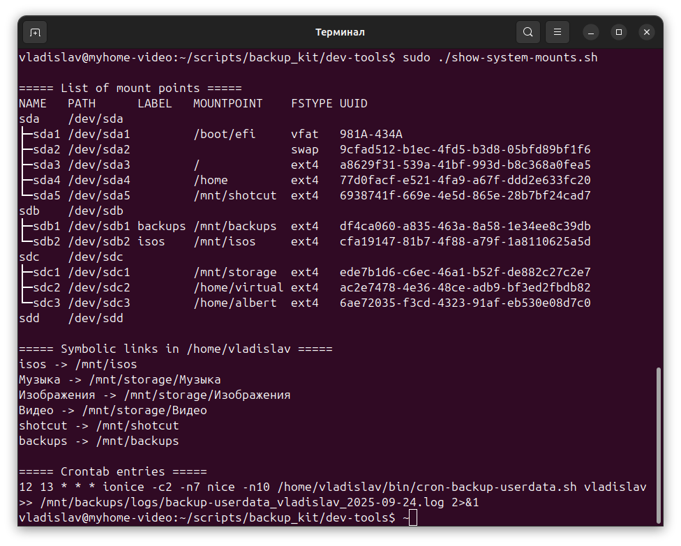

# Backup Kit — Резервное копирование и восстановление системы Ubuntu

[🇬🇧 English](../EN/README_EN.md) | [🇷🇺 Русский](README_RU.md)

**Reincarnation Backup Kit** — это набор Bash-скриптов для резервного копирования и восстановления при переустановке **Ubuntu** на SSD, а также для создания мультимедийного окружения (Shotcut, GIMP+G'MIC, Krita, Audacity).

## ✨ Возможности

### 📦 Резервное копирование и восстановление
Состоит из двух независимых частей:
1. **Резервное копирование системы** — конфигурация системы, списки пакетов, репозитории.
2. **Резервное копирование пользователя** — домашние каталоги (`/home/...`), документы и личные данные.

> ⚠️ Важно: обе части дополняют друг друга. Вы можете использовать только резервную копию системы, только резервную копию пользователя или обе сразу.

### 🎬 Мультимедийная среда
Состоит из двух шагов:
1. **Форматирование** выбранного жёсткого диска и создание пользователей.
2. **Тестирование видеокарты NVIDIA и CUDA**, установка программного обеспечения:
   - [Shotcut](https://shotcut.org/) (видеоредактор)
   - [GIMP+G'MIC](https://gmic.eu/) (графика)
   - [Krita](https://krita.org/en/) (рисование)
   - [Audacity](https://www.audacityteam.org/) (звук)
   - создание шаблонов для Shotcut

> ⚠️ Важно: Вы можете использовать настройку мультимедийной среды независимо, без резервной копии.

## Текстовое меню Reincarnation Backup Kit

После установки вы можете использовать простое текстовое меню:
```bash
~/bin/menu.sh
```

> ⚠️ Меню запустится автоматически после успешной установки.
> ⚠️ Для некоторых операций требуются права root (sudo).


## 🚀 Быстрое использование

```bash
git clone https://github.com/username/reincarnation-backup-kit.git
cd reincarnation-backup-kit
./install.sh

# Пример резервного копирования
./backup-system.sh
sudo ./backup-userdata.sh

# Пример полное обновление архива (с удалением старого зеркала)
sudo ./backup-userdata.sh --fresh

# Пример восстановления
./restore-system.sh
sudo ./restore-userdata.sh
```

## 📜 Доступные скрипты

- `install.sh` — universal installer for the Reincarnation Backup Kit.
- `backup-system.sh` - backup system settings and packages (shell).
- `backup-ubuntu-22.04.sh` — archiving Ubuntu 22.04 packages and configurations.
- `backup-ubuntu-24.04.sh` — archiving Ubuntu 24.04 packages and configurations.
- `backup-debian-12.sh` — archiving Debian 12 packages and configurations.
- `restore-system.sh` - universal system restore (shell).
- `restore-ubuntu-22.04.sh` - restore for Ubuntu 22.04.
- `restore-ubuntu-24.04.sh` - restore for Ubuntu 24.04.
- `restore-debian-12.sh` — restore for Debian 12.
- `backup-restore-userdata.sh` — carefully backup or restore user data.
- `backup-userdata.sh` - backup user data (wrapper for backup-restore-userdata.sh).
- `restore-userdata.sh` - secure data recovery (wrapper for backup-restore-userdata.sh).
- `check-last-archive.sh` — views archives available to the user.
- `add-cron-backup.sh` - adds a cron job for daily backups.
- `cron-backup-userdata.sh` - archives user data to /mnt/backups/user_data/.
- `clean-backup-logs.sh` - deletes old backup logs.
- `remove-cron-backup.sh` - removes the backup cron job.
- `install-nvidia-cuda.sh` - installation of the NVIDIA and CUDA driver.
- `check-shotcut-gpu.sh` - automatic NVIDIA configuration, GPU passthrough to Flatpak, and NVENC testing.
- `install-mediatools-flatpak.sh` - NVIDIA + CUDA check, media installation from Flathub, Shotcut presets.
- `install-mediatools-apt.sh` — installs multimedia software from APT.
- `hdd-setup-profiles.sh` - format the selected hard drive (HDD) and create users.
- `show-system-mounts.sh` - view system mount points, symbolic links, and cron jobs.
- `setup-symlinks.sh`- Creates directories on /mnt/storage and gracefully recreates symlinks.
- `check-cuda-tools.sh` - checking and managing CUDA Toolkit.
- `menu.sh` - Text menu for Reincarnation Backup Kit.
- `messages.sh` - Unified messages for all scripts.

## ⚖️ Лицензия

Лицензия MIT © 2025 Владислав Крашевский

## 📬 Контакты и поддержка

Автор: Владислав Крашевский
Поддержка: ChatGPT + документация проекта

## 🖼️ Скриншоты

<p align="center"> 
 
 </p>  </p> 
<p align="center"> 

 </p> 
<p align="center"> 

 </p> 
